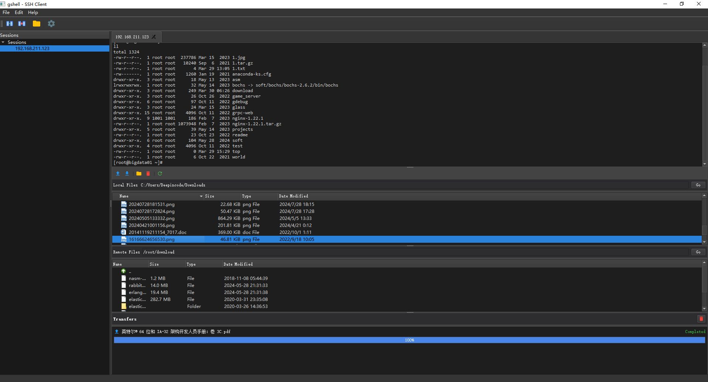

# GShell - Qt SSH Terminal Client

GShell is a lightweight, feature-rich SSH terminal client built with Qt framework. It provides a modern user interface for connecting to remote servers via SSH, with full support for ANSI color codes, terminal control sequences, and command history.





## Features

- **Secure SSH Connections**: Connect to remote servers using password or key-based authentication
- **Full Color Support**: Rich ANSI color support for syntax highlighting and colorized command output
- **Command History**: Easily navigate through previous commands using up/down arrow keys
- **Customizable Appearance**: Personalize fonts, colors, and terminal settings to your preference
- **Session Management**: Save and manage multiple SSH connection profiles
- **Terminal Control Sequences**: Support for complex terminal applications like top, htop, etc.

## Screenshots

_[Screenshots of the application would be added here]_

## System Requirements

- Qt 5.12 or higher
- A C++11 compliant compiler
- Supported platforms:
  - Windows 7 or newer
  - macOS 10.12 or newer
  - Linux (major distributions)

## Building from Source

### Prerequisites

- Qt development environment (Qt Creator recommended)
- C++ compiler (MSVC, GCC, or Clang)
- CMake 3.10 or higher (optional)

### Clone and Build

```bash
# Clone the repository
git clone https://github.com/yourusername/gshell.git
cd gshell

# Using Qt Creator
# Open the gshell.pro file in Qt Creator and build

# Or using command line
qmake
make # or nmake on Windows
```

## Usage

### Connecting to a Server

1. Launch GShell
2. Click "New Connection" or use the connection manager
3. Enter your server details:
   - Host: The hostname or IP address
   - Port: SSH port (default: 22)
   - Username: Your SSH username
   - Authentication: Password or private key file

### Keyboard Shortcuts

- **Ctrl+C**: Send interrupt signal to the remote process
- **Up/Down Arrow**: Navigate through command history
- **Ctrl+L**: Clear screen
- **Ctrl+D**: Send EOF

## Project Structure

- `terminalwidget.cpp/h`: Main terminal widget implementation
- `sshclient.cpp/h`: SSH client implementation
- `sessioninfo.h`: Session data structures
- `sshconnectionthread.cpp/h`: Thread handling for SSH connections

## Acknowledgements

- This project uses [LibSSH](https://www.libssh.org/) for SSH protocol implementation
- ANSI color processing inspired by various terminal emulators
- Qt framework for the cross-platform UI

## License

This project is licensed under the MIT License - see the LICENSE file for details.

## Contributing

Contributions are welcome! Please feel free to submit a Pull Request.

1. Fork the repository
2. Create your feature branch (`git checkout -b feature/amazing-feature`)
3. Commit your changes (`git commit -m 'Add some amazing feature'`)
4. Push to the branch (`git push origin feature/amazing-feature`)
5. Open a Pull Request 